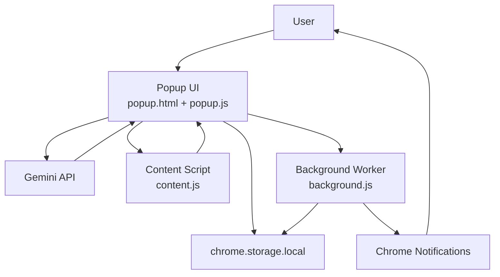
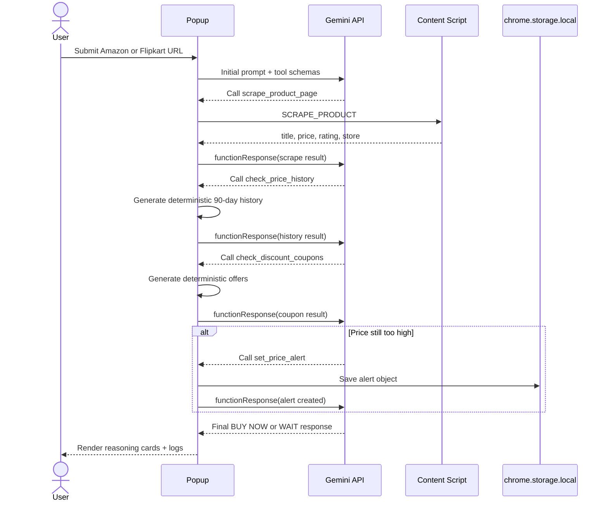
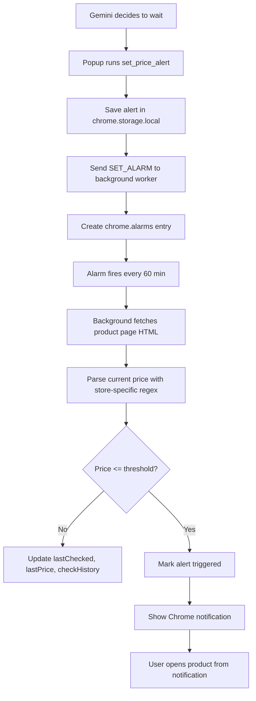

# Smart Cart: Full Implementation Breakdown

## Overview

Smart Cart is a Manifest V3 Chrome extension that helps a user decide whether to buy a product now or wait for a better price. It works on Amazon India, Amazon US, and Flipkart product pages.

The extension has three runtime pieces:

1. `popup.html` + `popup.js`: the user interface and the AI agent loop.
2. `content.js`: the page scraper that reads product data from the live tab DOM.
3. `background.js`: the service worker that manages recurring price checks and notifications.

At a high level, the popup sends a product URL to Gemini, Gemini decides which tool to call, the popup executes those tools locally in Chrome, and the results are sent back to Gemini until it produces a final verdict.

## Visual Architecture

When you want the fast mental model, this diagram is more useful than prose:

Interpretation:

- The popup is the orchestrator.
- Gemini decides which tool to call next.
- The content script provides live product facts from the open tab.
- The background worker owns recurring alert checks.
- `chrome.storage.local` is the persistence layer shared across popup and background code.

## What The Extension Actually Does

The implementation is centered around four tools declared in `popup.js`:

1. `scrape_product_page`
2. `check_price_history`
3. `check_discount_coupons`
4. `set_price_alert`

The system prompt instructs Gemini to use them in that order.

Important implementation detail:

- `check_price_history` does not call any real price history API. It generates a deterministic synthetic 90-day history from the product name and current price.
- `check_discount_coupons` does not scrape live store offers. It generates deterministic example offers from seeded pseudo-random logic.
- `set_price_alert` is real. It stores an alert, creates a Chrome alarm, and the background worker later fetches the product page to check for a lower price.

So the extension is best understood as a hybrid:

- Real product scraping from the current tab.
- Real background alert monitoring.
- Simulated history and discount intelligence.
- LLM-generated buy/wait explanation on top of those tool results.

## File-By-File Architecture

### `manifest.json`

This is the extension entry point and capability declaration.

It defines:

- Manifest V3
- `background.js` as the service worker
- `popup.html` as the action popup
- `content.js` as the content script injected on Amazon and Flipkart
- permissions: `activeTab`, `storage`, `alarms`, `notifications`, `scripting`, `tabs`
- host permissions for Amazon, Flipkart, and Gemini APIs

### `popup.html`

This provides the extension UI and splits the popup into two screens:

- Setup screen for entering a Gemini API key and choosing a model.
- Main screen for entering a product URL, running analysis, reading logs, and viewing active alerts.

The popup also contains:

- A provider pill that shows the selected Gemini model.
- An analysis tab for step cards and alerts.
- A logs tab for raw runtime events.
- A status bar with step count, token count, and timer.

### `styles.css`

This is purely presentation. It gives the popup a dark dashboard-style UI with:

- fixed popup dimensions
- collapsible reasoning cards
- tabbed analysis/log views
- styled alert cards
- status bar chips for step, tokens, and elapsed time

### `content.js`

This runs on supported product pages and handles DOM scraping.

It exposes one message-based capability:

- listens for `SCRAPE_PRODUCT`
- detects whether the page is Amazon or Flipkart
- extracts title, price, rating, and some review metadata where available
- returns a structured result object to the popup

Store-specific behavior:

- Amazon: tries multiple selectors for title, price, rating, and review count.
- Flipkart: tries multiple selectors for title, price, and rating.

If scraping fails, it returns `success: false` and an error.

### `background.js`

This is the alert-monitoring service worker.

Responsibilities:

- create recurring alarms when requested by the popup
- clear alarms when alerts are removed
- react to `chrome.alarms.onAlarm`
- fetch the stored product URL directly
- parse the latest price from raw HTML using regex patterns
- send a Chrome notification when the price drops below the threshold

It also stores monitoring state back into `chrome.storage.local`, including:

- `lastChecked`
- `lastPrice`
- `checkHistory`
- `triggered`

## End-To-End Flow

This is the main runtime sequence during a normal analysis run:

### 1. User connects Gemini

On first load, the popup checks `chrome.storage.local` for:

- `apiKey`
- `geminiModel`
- `lastSession`

If no API key exists, the setup screen is shown.

The save flow:

1. User enters a Google AI Studio key.
2. The popup validates that it starts with `AIza`.
3. The popup stores `apiKey` and `geminiModel` in local storage.
4. The main screen becomes active.

The popup can also fetch available Gemini models directly from the Gemini models API.

### 2. User starts an analysis

When the user clicks the analyze button:

1. The popup validates that the URL is present.
2. It restricts analysis to Amazon or Flipkart URLs.
3. It loads `apiKey` and `geminiModel` from storage.
4. It clears previous chain output and logs.
5. It starts the timer, step chip, token chip, and status bar.
6. It calls `runGemini(url, apiKey, model)`.

### 3. Gemini agent loop starts

`runGemini()` sets up:

- a system instruction that enforces tool order
- the initial user message containing the product URL and task instructions
- a loop with up to 8 turns

On each turn it:

1. Calls `generateContent` on the selected Gemini model.
2. Passes the full running conversation in `contents`.
3. Enables function calling with the declared tool schemas.
4. Logs the request metadata.
5. Updates token counters from `usageMetadata`.
6. Renders any text response as an "Agent Response" card.

If Gemini returns no function calls, the loop ends and the run is considered complete.

If Gemini returns function calls, the popup executes each one locally and appends the results back into the conversation as `functionResponse` parts.

### 4. Tool execution

All tool calls are routed through `executeTool()`.

#### Tool 1: `scrape_product_page`

`toolScrape(url)` tries two approaches:

1. Send a message to the content script already running in the tab.
2. If messaging fails, inject a script with `chrome.scripting.executeScript` and scrape directly.

Returned data typically includes:

- `title`
- `price`
- `currency`
- `store`
- `rating`
- `url`

This is the most grounded part of the toolchain because it pulls data from the actual open product page.

#### Tool 2: `check_price_history`

`toolPriceHistory(productName, currentPrice, currency)` builds a seeded pseudo-random 90-day price series.

How it works:

- It derives a numeric seed from the product name.
- It uses a deterministic linear-congruential generator.
- It creates a base price above the current price.
- It introduces small variance, occasional sale dips, and mild time drift.
- It computes average, min, max, 7-day trend, and relative position.

Then it returns:

- `avgPrice90d`
- `minPrice90d`
- `maxPrice90d`
- `vsAverage`
- `vsAllTimeLow`
- `trend7d`
- `verdict`
- `recommendation`
- `recommendedBuyPrice`

Verdict rules are heuristic:

- near the low -> `EXCELLENT`
- below average -> `GOOD`
- around average -> `FAIR`
- above average -> `EXPENSIVE`

#### Tool 3: `check_discount_coupons`

`toolCheckCoupons(productName, currentPrice, store, currency)` also uses seeded pseudo-random logic.

It creates deterministic sample offers from three buckets:

- bank offers
- coupon codes
- cashback platforms

Then it calculates:

- per-offer discount amounts
- effective prices
- best effective price
- total savings
- savings percentage

The result is rendered into grouped offer cards in the popup.

This tool is illustrative, not connected to live store offer data.

#### Tool 4: `set_price_alert`

`toolSetAlert(url, productName, thresholdPrice, currentPrice, currency)` creates a persistent alert object.

It:

1. creates an ID like `alert_<timestamp>`
2. stores the alert under `alerts` in local storage
3. sends `SET_ALARM` to the background worker
4. creates a Chrome alarm named `smartcart_<alertId>`
5. refreshes the alerts panel in the popup

Stored alert shape includes:

- product URL and name
- threshold and current price
- currency
- timestamps
- trigger state
- rolling `checkHistory`

### 5. Reasoning chain and logs

Every run produces two user-visible traces:

1. Reasoning cards in the Analysis tab.
2. Detailed logs in the Logs tab.

The logs are intentionally split across two styles at once:

- a session-style trace showing user input, iterations, tool calls, tool completion, and final answer
- structured payload logging for model metadata, tool arguments, and tool results

The popup also persists the last run into `lastSession` so reopening the popup restores:

- rendered reasoning chain HTML
- log lines
- last analyzed URL

That means the popup behaves more like a lightweight session console than a stateless form.

### 6. Background alert monitoring

When the alarm fires, `background.js` does the following:

1. Confirms the alarm name starts with `smartcart_`.
2. Looks up the matching alert from storage.
3. Fetches the product page HTML using `fetch()`.
4. Tries store-specific regex patterns to extract the current price.
5. Appends the latest check to `checkHistory`.
6. Updates `lastChecked` and `lastPrice`.
7. If the price is at or below the threshold, marks the alert as triggered and sends a notification.

The history is capped to the last 48 checks.

With the current `ALARM_PERIOD` of 60 minutes, that represents about two days of retained check history.

The alert lifecycle is easier to explain visually:

### 7. Notifications

When a price drops enough, the service worker creates a Chrome notification with an "Open Product" button.

The notification ID is tied to the alert ID, so when the button is clicked the worker opens the exact product URL associated with that alert.

## Data Stored In `chrome.storage.local`

The extension uses local storage as its only persistence layer.

### `apiKey`

- Google AI Studio API key entered by the user.

### `geminiModel`

- currently selected Gemini model string.

### `lastSession`

- `chainHtml`: rendered reasoning UI markup
- `logLines`: log entries shown in the popup
- `url`: last analyzed product URL

### `alerts`

An object keyed by alert ID. Each alert includes:

- `id`
- `productUrl`
- `productName`
- `thresholdPrice`
- `currentPrice`
- `currency`
- `createdAt`
- `lastChecked`
- `lastPrice`
- `triggered`
- `checkHistory`

## LLM Integration Details

The live implementation uses Gemini via:

- `https://generativelanguage.googleapis.com/v1beta`
- `models/<model>:generateContent`

It configures Gemini with:

- function declarations for all four tools
- automatic function calling mode
- `maxOutputTokens: 1500`
- `temperature: 0.1`

The popup tracks approximate total tokens used by summing:

- `promptTokenCount`
- `candidatesTokenCount`

## Runtime Characteristics

The popup uses a single Gemini-driven loop with a growing conversation state.

Core behavior:

- each model turn can either request a tool or return a final answer
- every tool result is appended back into the conversation before the next turn
- the popup exposes that chain as visible step cards and logs instead of hiding it behind one final response
- long-running monitoring is delegated to the background worker through Chrome alarms

## Strengths Of The Current Design

- No build step and very small project footprint.
- Clean separation between popup UI, page scraping, and background alarms.
- Real Chrome-native alert monitoring with persistent storage.
- Strong observability in the popup through logs and reasoning cards.
- Content-script-first scraping with a scripting fallback.

## Limitations And Risks

### 1. Product intelligence is partly simulated

The extension presents price history and discount analysis as if they were market intelligence, but both are locally generated heuristics. That is useful for demos, not for production-grade price analysis.

### 2. Scraping is selector-fragile

Amazon and Flipkart frequently change markup. Both the DOM selectors and background regex patterns can break.

### 3. Background fetch parsing is simpler than popup scraping

The popup uses DOM selectors on the live tab, but the background worker uses regex over fetched HTML. Those parsing strategies can drift and produce inconsistent results.

### 4. Notification detail is still limited

Notification handling is now mapped to the exact alert, but the notification body is still intentionally simple and does not include richer context like offer breakdowns or trend details.

### 5. Stored API key is local but not encrypted

The Gemini API key is stored in `chrome.storage.local`, which is acceptable for a local extension demo but not a hardened secret-management solution.

## Practical Mental Model

If you want to reason about the extension quickly, think of it like this:

1. The popup is the orchestrator.
2. The content script supplies real product facts from the active page.
3. The popup invents price-history and coupon context locally.
4. Gemini turns those tool results into a human-readable buy/wait decision.
5. The background worker handles the only truly asynchronous long-running behavior: price alerts.

That is the complete working model of the current project.