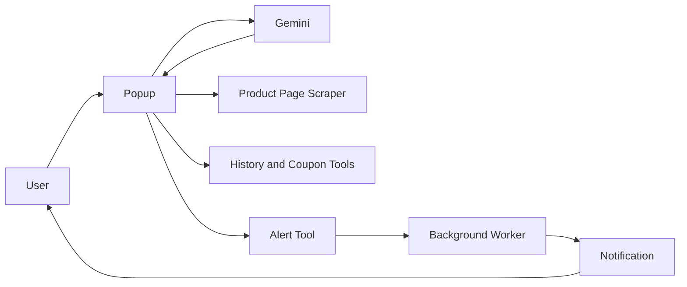

# Smart Cart - AI Price Tracker Chrome Extension

Smart Cart is a Manifest V3 Chrome extension for Amazon and Flipkart product pages. It uses Gemini in a multi-turn tool-calling loop to answer one question: should you buy this product now, or wait for a better price?

The extension combines:

- live DOM scraping from the current product tab
- Gemini-generated analysis and final verdict
- local alert storage and hourly background price monitoring
- a popup UI that shows reasoning cards, logs, token counts, and active alerts

## Visual Summary



In one line: the popup asks Gemini what to do next, runs the requested shopping tools locally, and can hand off long-running price tracking to the background worker.

## What It Supports

- Amazon India
- Amazon US
- Flipkart

## How It Works

The popup runs a tool-calling agent with four tools:

1. `scrape_product_page`
2. `check_price_history`
3. `check_discount_coupons`
4. `set_price_alert`

Flow:

1. User opens a product page.
2. User opens the extension popup and submits the URL.
3. Gemini calls `scrape_product_page` to get live product data.
4. Gemini calls `check_price_history` for a 90-day heuristic analysis.
5. Gemini calls `check_discount_coupons` for estimated bank, coupon, and cashback savings.
6. If the effective price is still too high, Gemini can call `set_price_alert`.
7. The popup displays the final buy-now or wait recommendation.

Important note:

- price history and coupon data are generated locally with deterministic heuristics
- alert monitoring is real and runs through Chrome alarms in the background worker

## Assignment Fit

This project was built to satisfy the Session 3 agentic Chrome plugin assignment.

It meets the key requirements because it:

- calls the LLM multiple times in a tool-driven loop
- carries forward the full prior interaction on each turn
- shows the reasoning chain, tool calls, and tool results in the popup
- defines 4 custom tools for the shopping use case
- supports continuous monitoring through background price alerts

## Project Structure

```text
smart-fake-cart/
├── manifest.json
├── popup.html
├── popup.js
├── background.js
├── content.js
├── styles.css
├── HOW_IT_WORKS.md
└── icons/
```

## Setup

### 1. Load the extension in Chrome

1. Open `chrome://extensions/`
2. Enable Developer Mode
3. Click Load unpacked
4. Select the `smart-fake-cart` folder

### 2. Get a Gemini API key

1. Open https://aistudio.google.com/apikey
2. Create a Google AI Studio API key
3. Copy the key that starts with `AIza`

### 3. Connect the popup

1. Click the Smart Cart extension icon
2. Paste the Gemini API key
3. Optionally fetch and select another Gemini model
4. Click Connect

## Usage

1. Open an Amazon or Flipkart product page
2. Open the extension popup
3. Click the current-tab button or paste the product URL manually
4. Click `Ask Agent: Should I buy now?`
5. Watch the analysis cards and logs as the agent runs
6. If an alert is created, track it in the Price Alerts panel

## Alerts

If the agent decides the current price is too high, it can create an alert.

Alert behavior:

- alert configuration is stored in `chrome.storage.local`
- the popup asks the background worker to create a Chrome alarm
- the background worker re-checks the page every 60 minutes
- if the price falls to or below the threshold, Chrome shows a notification

## Storage Used

The extension stores the following keys in `chrome.storage.local`:

- `apiKey`
- `geminiModel`
- `lastSession`
- `alerts`

`lastSession` is used to restore the previous reasoning chain, logs, and URL when the popup is reopened.

## Implementation Notes

- The active runtime path is Gemini, not Claude.
- The manifest description still mentions Claude because the project contains leftover legacy references.
- `popup.js` still contains an unused `runClaude()` path, but the shipped UI only calls `runGemini()`.
- Scraping depends on Amazon and Flipkart DOM structure, so selector changes can break extraction.

## Full Technical Breakdown

See `HOW_IT_WORKS.md` for a full architecture and runtime breakdown.
